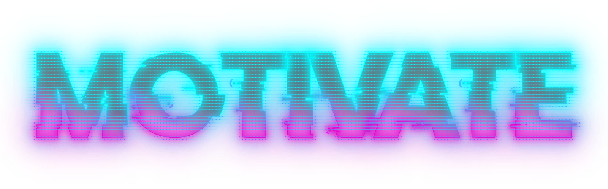

Приложение MOTIVATE создано с целью упрощения первого шага в избавлении от вредных привычек и приобретении новых.

### Аутентифицируйся, зарегистрируйся или выполни вход через Google account.

### Заполни свой профиль.

### Добавь привычки, над которыми ты хочешь работать.

### Фиксируй свои достижения в одно касание.

### Редактируй и удаляй привычки в разделе "DETAILS".

### Следи за своим прогрессом в разделе статистики.

### Мотивируйся цитатами великих людей в разделе "QUOTE".

## MVP функционал:

* создание, редактирование удаление привычек,
* фиксирование достижений,
* просмотр прогресса

## Следующие шаги:

* размещение приложения на AppleStore и Google Play;
* расширение игрификации;
* создание web версии для более удоьной работы со статистикой

 ## Состав команды:

-[Никита Ламбин](https://github.com/LamNik324)

-[Дмитрий Куприн](https://github.com/Dmitry-Kuprin)

-[Денис Эпштейн](https://github.com/DenisEps)

-[Егор Богданов](https://github.com/YegorBogdanov)
