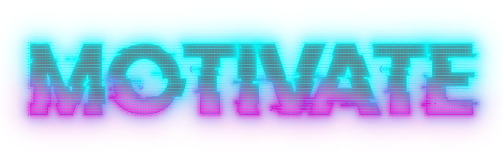
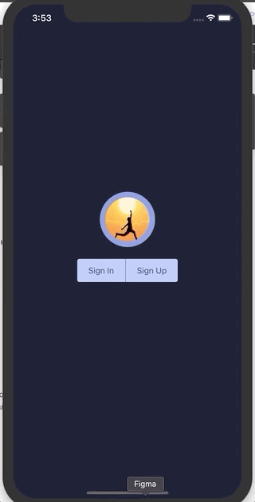

MOTIVATE является прототипом мобильного приложения для iOS/Android, которое призвано помочь в формировании полезных привычек и избавлении от вредных  
MOTIVATE is a prototype of a mobile app for iOS/Android which can help to get good habits and throw off bad ones.

#### Аутентифицируйся, зарегистрируйся или выполни вход через Google account. (Authentificate, register or sign with Google account)

#### Заполни свой профиль. (Fill in your profile)

#### Добавь привычки, над которыми ты хочешь работать.  Фиксируй свои достижения в одно касание. (Add habits which you want to work at.   Fix your achievements in one tap)

#### Редактируй и удаляй привычки в разделе "Details".  Следи за своим прогрессом в разделе статистики.  Мотивируйся цитатами великих людей в разделе "Quote".   (Edit and delete habits in "Details".   Watch your progress in "Statistics".   Motivete yourself by quotes of great people in "Qoute")

### MVP функционал (MVP functionality):

* создание, редактирование удаление привычек; (adding, editing and deleting of habits)
* фиксирование достижений; (achievments fixing)
* просмотр прогресса. (watching progress)

### Следующие шаги (Next steps):

* деплой приложения в AppStore, GooglePlay; (appstore, GooglePlay deploying)
* расширение игрофикации приложения; (gamification extending)
* создание web версии для более удобной работы со статистикой. (developing web version for more comfortable work with statistics)

### Использованные технологии (Stack):

* React Native;
* Firebase;
* Redux.

### Над приложением работали (Team):

* [Егор Богданов](https://github.com/YegorBogdanov);
* [Денис Эпштейн](https://github.com/DenisEps);
* [Никита Ламбин](https://github.com/LamNik324);
* [Дмитрий Куприн](https://github.com/Dmitry-Kuprin).
